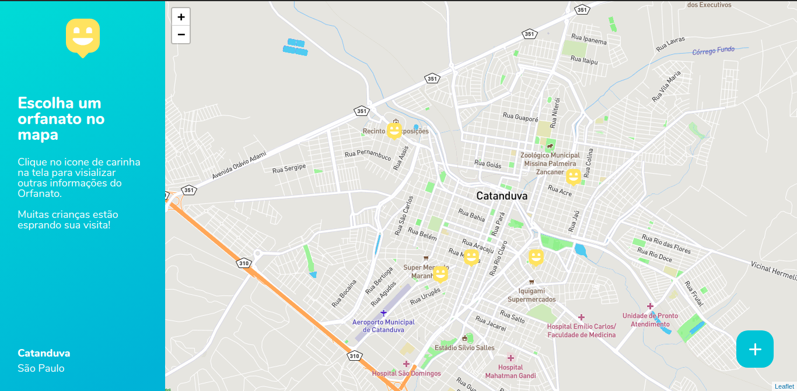

<h1 align="center">
    
</h1>

  <a href="#-tecnologias">Tecnologias</a>&nbsp;&nbsp;&nbsp;|&nbsp;&nbsp;&nbsp;
  <a href="#-projeto">Projeto</a>&nbsp;&nbsp;&nbsp;|&nbsp;&nbsp;&nbsp;
  <a href="#memo-licença">Licença</a>

 

  

 

  

## 💻 Projeto

O Happy é uma aplicação que conecta pessoas à casas de acolhimento institucional para fazer o dia de muitas crianças mais feliz. Desenvolvido durante e NLW3.

## 🚀 Tecnologias

Esse projeto foi desenvolvido com as seguintes tecnologias:

- [Node.js](https://nodejs.org/en/)
- [Express](https://expressjs.com/pt-br/)
- [SQLite](https://www.sqlite.org/index.html)
- [Handlebars](https://handlebarsjs.com/)

## 🔁 Clonar o projeto

    $ git clone git@github.com:cicerosnt/nlw3-discovert-happy.git

    $ npm init

    $ npm install express

    $ npm install nodemon

    $ npm install hbs

    $ npm install sqlite-async

Entre na pasta raiz do projeto e com o NodeJs já instalado executar o comanado abaixo:
    
    $ node src/database/db.js

E para rodar o projeto em seu navegador:

    $ npm go

Acesse no seu navegador:

    http://127.0.0.1:5500

## 🗺️ Configurando o Mapa

Navegue até a pasta public/js, abre o arquivo map.js e adicione o seu token para o mapa Leaflet:

    L.tileLayer('https://api.mapbox.com/styles/v1/{id}/tiles/{z}/{x}/{y}?access_token={accessToken}', { 
      maxZoom: 18,
      id: 'mapbox/streets-v11',
      tileSize: 512,
      zoomOffset: -1,
      accessToken: 'token_leaflet_here' //inserir seu token leaflet
    }).addTo(mymap);

Você pode adquirir o token seguindo a documentação neste link [ir para o site](https://leafletjs.com/examples/quick-start/)

## 😧 Dificuldades 

#time

A semana NLW3 é um evento orquestrado pelo time da Rocketseat, o conteúdo fica disponível somente na quela semana, e por isso somete agora estou finalizando e publicando o projeto, isso mesmo! Um mês depois... mas cheguei lá “Congratulations”. 

## 📘 Licença

Esse projeto está sob a licença MIT. [LICENSE](LICENSE.md)

---

Entre em conato ✉️ [cicero.dsantos@outlookk.com.br](cicero.dsantos@outlookk.com.br)